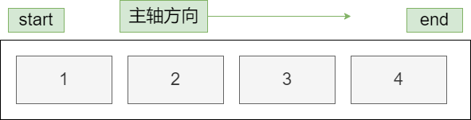

# flexible

flex 布局(又称：flexiblebox,弹性布局)，是一种控制一行或一列的一维的布局模型，flexbox 给子元素提供了强大的空间分部能力和对齐能力

## 为什么需要 flex 布局？

- 长久以来，css 布局中唯一可靠并且浏览器兼容的是 float 布局和 position 布局
- 这 2 种布局存在很多缺陷，比如居中问题和自由度不高等问题
- flex 布局能完全掌控子元素的排列方式和空间收缩膨胀

## 容器

- flex container

给元素设置 display: flex 或者 display: inline-flex 就可以将该元素变成 flex 容器

- flex item

当元素设置为 flex 后，该元素的直接子元素成为 flex item，此时 flex item 有以下特点

1. flex item 不在严格区分行内元素和块级元素，所有直接子元素的布局和排列受父元素的属性影响
2. flex item 是包含元素，可以设置宽高

## 轴

- flex container 默认情况下主轴方向为 X 轴方向,Y 轴方向为交叉轴
- flex item 元素会沿着主轴方向依次排列
- 默认情况下，从 start 为起始位置，end 为结束位置，从左至右的方向

## flex container 属性

- direction: 可以改变主轴方向和起始位置

  - row: 默认值，表示以 X 轴为主轴方向，并且从左边开始作为起始位置
  - row-reverse: 表示以 X 轴为主轴方向，并且从右边开始作为起始位置
  - column: 表示以 Y 轴为主轴方向，并且从上边开始作为起始位置
  - column-reverse: 表示以 Y 轴为主轴方向，并且从底部开始作为起始位置

- wrap: 可以改变 flex container 是否需要换行，默认情况下，flex container 内的子元素会在一行依次排列，当子元素宽度超过父元素时也不会换行，会压缩子元素的空间依次排列

  - nowrap: 默认值，表示一行排列不换行
  - wrap: 表示换行，当子元素宽度超过父元素时会换行显示
  - wrap-reverse: 表示换行，并且会以相反的方向排列

- justify-content

  - flex-start: 让子元素在父元素内沿着主轴与 start 对齐
  - flex-end: 让子元素在父元素内沿着主轴与 end 对齐
  - center: 让子元素在父元素内沿着主轴居中对齐
  - space-between: 让子元素在父元素内沿着主轴将元素先放 2 边，中间等分
  - space-evenly: 让子元素在父元素内沿着主轴将元素 2 边留出一点距离，中间等分
  - space-around: 让子元素在父元素内沿着主轴将元素 2 边留出一点中间等分的一半距离，中间等分

- align-items(单行)

  - flex-start: 让子元素在父元素内沿着交叉轴与 start 对齐
  - flex-end: 让子元素在父元素内沿着交叉轴与 end 对齐
  - center: 让子元素在父元素内沿着交叉轴居中对齐
  - normal: 让子元素在父元素内沿着交叉轴进行高度拉伸，想进行高度拉伸子元素必须高度为 auto

- align-content(多行)

  - 与 justify-content 用法是一致的，作用在交叉轴的多行元素上

- flex-flow: direction 和 wrap 的复合属性

## flex item 属性

- order
  控制子元素的排列顺序，数字越小越往前排

- align-self
  控制子元素的单个对齐方式

- flex-grow
  可以设置非负数字(正小数、正整数),默认值是 0,当该行有剩余空间时，会将剩余空间分配给设置了 flex-grow 属性的元素

- flex-shrink
  可以设置非负数字(正小数、正整数),默认值是 1,默认当子元素宽度超过父元素时，会压缩子元素的宽度一行展示，默认会每个元素平均压缩，当设置了 flex-shrink 时，只会压缩设置了该属性的单个属性

- flex-basic
  设置基础尺寸，当某个单词过长时，会自动拉伸自身的宽度以来展示完所有的内容

- flex
  复合属性(grow|shrink|basic),可以写一个或多个属性

## flex 布局常见问题:

- 对齐问题: 当设置了对齐时，因为元素不够而产生布局错乱问题

- 解决方式:通过添加伪元素，给最后添加列的个数减去 2 个的元素
